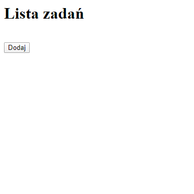
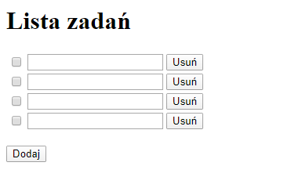
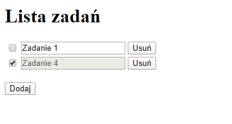
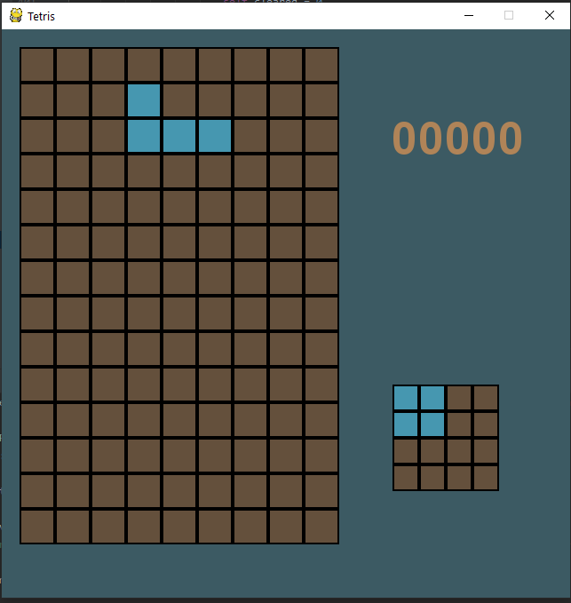
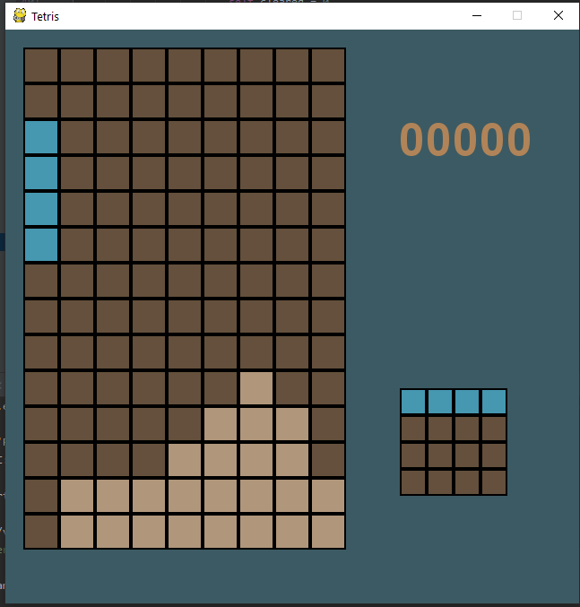
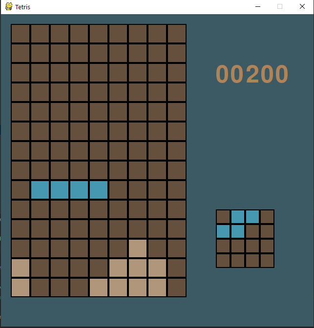
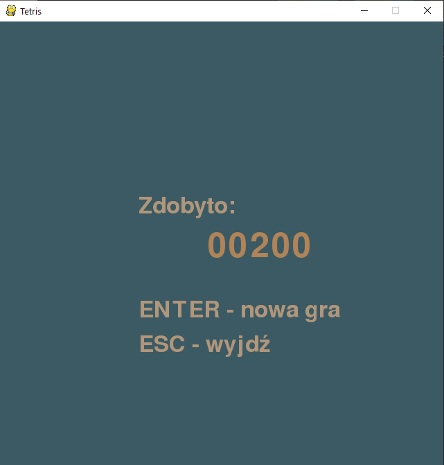

# Projekty zaliczeniowe z Podstaw Programowania Python

Lista projektów:
1. [Lista zadań (Flask)](#lista-zadań)
2. [Tetris (pyGame)](#tetris)

Źródła dostępne w serwisie [GitHub](https://github.com/Trishun/ppp-19-20)

### Część wspólna

Oba projekty zostały stworzone w oparciu o język Python w wersji 3.7 (x64)

### Lista zadań

Aplikacja umożliwia utworzenie podstawowej listy zadań.

Do jej stworzenia wykorzystano biblioteki Flask oraz jQuery.

Zadanie można dodać, zmienić treść, oznaczyć jako wykonane oraz usunąć.
Zaznaczyć należy, że każdorazowe wykonanie jakiejkolwiek operacji powoduje wykonanie operacji
w bazie danych, a następnie przeładowanie strony.

Te operacje to:
- dodanie zadania,
- usunięcie zadania,
- oznaczenie zadania jako zrobione/niezrobione,
- modyfikacja treści zadania (w momencie zmiany "focusa")

Każda z powyższych operacji została przypisana do methody:

- `add` - metoda bezparametrowa
- `update` - bazująca na sparametryzowanym zapytaniu: `id`, `checked`, `value`
- `remove` - bazująca na sparametryzowanym adresie: `id`

Po uruchomieniu przeglądarki wyświetli się następująca treść:



Przyciskiem "Dodaj" można dodać nowe, puste zadanie.
Stan po czterokrotnym wykonaniu tej operacji ukazuje zrzut:



Kolejne operacje modyfikacji i oznaczania wykonanych zadań ukazane są na zrzucie:


Operacja usunięcia (zarówno zadania wykonanego jak i niewykonanego) przedstawiona jest na zrzucie:



Przykładowy wyciąg z serwera w trakcie realizowania operacji:

```
127.0.0.1 - - [07/Feb/2020 16:30:31] "GET /api/add HTTP/1.1" 200 -
127.0.0.1 - - [07/Feb/2020 16:30:31] "GET / HTTP/1.1" 200 -
127.0.0.1 - - [07/Feb/2020 16:31:19] "GET /api/update?id=11&value=Zadanie%202 HTTP/1.1" 200 -
127.0.0.1 - - [07/Feb/2020 16:31:19] "GET / HTTP/1.1" 200 -
127.0.0.1 - - [07/Feb/2020 16:31:29] "GET /api/update?id=13&value=Zadanie%204 HTTP/1.1" 200 -
127.0.0.1 - - [07/Feb/2020 16:31:29] "GET / HTTP/1.1" 200 -
127.0.0.1 - - [07/Feb/2020 16:31:31] "GET /api/update?id=11&checked=true HTTP/1.1" 200 -
127.0.0.1 - - [07/Feb/2020 16:31:31] "GET / HTTP/1.1" 200 -
127.0.0.1 - - [07/Feb/2020 16:31:34] "GET /api/update?id=13&checked=true HTTP/1.1" 200 -
127.0.0.1 - - [07/Feb/2020 16:31:34] "GET / HTTP/1.1" 200 -
127.0.0.1 - - [07/Feb/2020 16:32:07] "GET /api/remove/11 HTTP/1.1" 200 -
127.0.0.1 - - [07/Feb/2020 16:32:07] "GET / HTTP/1.1" 200 -
```


### Tetris

Aplikacja powstała w oparciu o bibliotekę pyGame 1.9.6. Jest to odwzorowanie klasycznej wersji gry.
Ekran składa się z planszy 9x14 kwadratów, w których umieszcza się opadające figury.
W prawej części widnieje liczba punktów, oraz mała plansza 4x4 wyświetlająca informację o
kolejnym elemencie i jego ułożeniu
Celem gry jest zapełnienie rzędu, który to zostaje wymazany, a to, co nad nim obniżone.
Za operację wyczyszczenia rzędu gracz otrzymuje 100 punktów.
Gra kończy się, gdy nie ma możliwości wstawienia kolejnego elementu.

Punktacja uwzględnia bonusy za wymazanie więcej niż jednego rzędu przy jednym ruchu.
Obliczenia są prowadzone według wzoru:
`(l.rzędów)! * 100`

Ekran rozpoczynający rozgrywkę wygląda następująco:



Jak widać na kolejnej ilustracji, poruszający się klocek jest koloru niebieskiego, natomiast te już ustawione
są koloru jasnobeżowego.



Usunięcie dwóch rzędów spowodowało obniżenie pozostałych o dwie kratki:



Ekran na zakończenie gry:



##### Mechanika gry

Wyświetlany obraz jest tworzony na podstawie istniejących w pamięci macierzy z pakietu numpy.

Macierze te uwzględniają planszę oraz poruszające się po niej elementy.
Bazową macierzą jest plansza gry. Składają się na nią 0 - brak klocka i 1 - obecność klocka.
Każdy ruch składa się z kilku kroków:
1. pobranie kopii macierzy,
2. wstawienie elementu (reprezentowanego poprzez macierz 0 - brak klocka i 2 - obecność klocka) w zadane współrzędne,
3. oczekiwanie na działanie użytkownika określającego kolejny ruch,
4. przechwycenie kierunku lub ustawienie domyślnego - dół
5. sprawdzenie kierunku - czy jest możliwe przemieszczenie elementu, tj. czy macierz bazowa zawiera 0 w miejscach gdzie znajdzie się element,
6. przemieszczenie lub zabronienie przemieszczenia w przypadku kierunków bocznych, przemieszczenie lub dołączenie do istniejącej struktury (wstawienie w miejsce 2 liczb 1) w przypadku kierunku domyślnego a następnie nadpisanie macierzy podstawowej.


