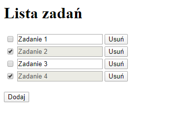

# Projekty zaliczeniowe z Podstaw Programowania Python

Lista projektów:
1. [Lista zadań (Flask)](#lista-zadań)
2. [Tetris (pyGame)](#tetris)

Źródła dostępne w serwisie [GitHub](https://github.com/Trishun/ppp-19-20)

### Część wspólna

Oba projekty zostały stworzone w oparciu o język Python w wersji 3.7 (x64)

### Lista zadań

Aplikacja umożliwia utworzenie podstawowej listy zadań.

Do jej stworzenia wykorzystano biblioteki Flask oraz jQuery.

Zadanie można dodać, zmienić treść, oznaczyć jako wykonane oraz usunąć.
Zaznaczyć należy, że każdorazowe wykonanie jakiejkolwiek operacji powoduje wykonanie operacji
w bazie danych, a następnie przeładowanie strony.

Te operacje to:
- dodanie zadania,
- usunięcie zadania,
- oznaczenie zadania jako zrobione/niezrobione,
- modyfikacja treści zadania (w momencie zmiany "focusa")

Każda z powyższych operacji została przypisana do methody:

- `add` - metoda bezparametrowa
- `update` - bazująca na sparametryzowanym zapytaniu: `id`, `checked`, `value`
- `remove` - bazująca na sparametryzowanym adresie: `id`

Po uruchomieniu przeglądarki wyświetli się następująca treść:


Przyciskiem "Dodaj" można dodać nowe, puste zadanie.
Stan po czterokrotnym wykonaniu tej operacji ukazuje zrzut:


Kolejne operacje modyfikacji i oznaczania wykonanych zadań ukazane są na zrzucie:



Operacja usunięcia (zarówno zadania wykonanego jak i niewykonanego) przedstawiona jest na zrzucie:


Przykładowy wyciąg z serwera w trakcie realizowania operacji:

```
127.0.0.1 - - [07/Feb/2020 16:30:31] "GET /api/add HTTP/1.1" 200 -
127.0.0.1 - - [07/Feb/2020 16:30:31] "GET / HTTP/1.1" 200 -
127.0.0.1 - - [07/Feb/2020 16:31:19] "GET /api/update?id=11&value=Zadanie%202 HTTP/1.1" 200 -
127.0.0.1 - - [07/Feb/2020 16:31:19] "GET / HTTP/1.1" 200 -
127.0.0.1 - - [07/Feb/2020 16:31:29] "GET /api/update?id=13&value=Zadanie%204 HTTP/1.1" 200 -
127.0.0.1 - - [07/Feb/2020 16:31:29] "GET / HTTP/1.1" 200 -
127.0.0.1 - - [07/Feb/2020 16:31:31] "GET /api/update?id=11&checked=true HTTP/1.1" 200 -
127.0.0.1 - - [07/Feb/2020 16:31:31] "GET / HTTP/1.1" 200 -
127.0.0.1 - - [07/Feb/2020 16:31:34] "GET /api/update?id=13&checked=true HTTP/1.1" 200 -
127.0.0.1 - - [07/Feb/2020 16:31:34] "GET / HTTP/1.1" 200 -
127.0.0.1 - - [07/Feb/2020 16:32:07] "GET /api/remove/11 HTTP/1.1" 200 -
127.0.0.1 - - [07/Feb/2020 16:32:07] "GET / HTTP/1.1" 200 -
```


### Tetris

Aplikacja powstała w oparciu o bibliotekę pyGame 1.9.6
